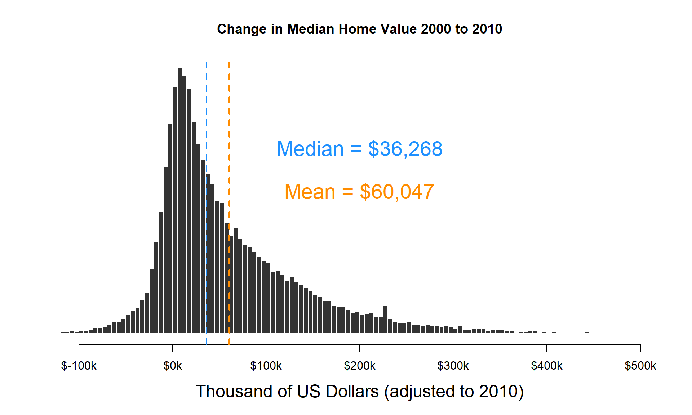
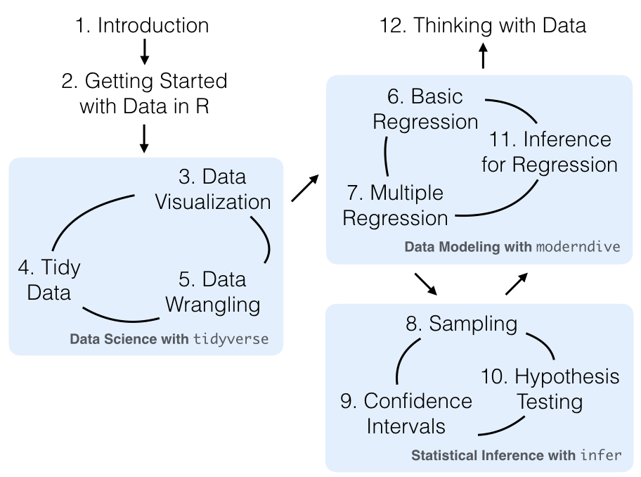
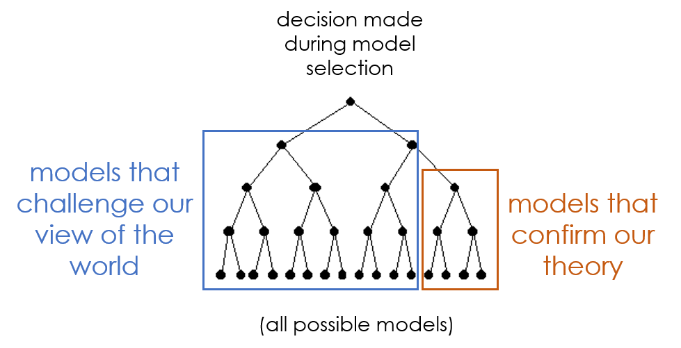

# A Data-Driven Approach to Neighborhood Change 

This repository stores resources and project data for labs examining data-driven approaches to urban policy. 

Specifically this project examines the effectiveness of two larger federal block-grant programs that target low-income neighborhoods.  

* **New Market Tax Credits (NMTC)**  
* **Low Income Housing Tax Credits (LIHTC)** 

The project uses Census data to model community change between the periods 2000 and 2010 (the data goes back as far as 1970). 

Tax credit dollars are then aggregated by Census Tracts and form the "treatment" in the study. 

The project was designed to give students a big enough task that it was a realistic project, but provide enough resources for it to be manageable. 

## Causal Analysis With Non-Experimental Data (Counterfactual Reasoning)

The NMTC and LIHTC programs are also market-based developer-driven, which means there are likely selection issues (community development banks give out loans that need to be repaid, so they will target census tracts with high potential for success). These pose interesting estimation challenges that can be interesting to students studying program evaluation and applied econometrics. 

Program participation is determined through some means-testing, which provides opportunities to leverage eligibility-criteria cut-off points to create interesting quasi-experimental counterfactuals in order to overcome selection problems that will most certainly bias estimates of program impact. 

This allows for comparisons of estimation approaches using: 

* Regular OLS model 
* Metro-level fixed effects 
* Difference-in-difference models 
* Matched census tracts 
* Regression discontinuity design 

And finally, the data is complex enough that specification considerations will have a big impact on inferences. The comparison of program impact estimates under different specifications can illustrate the importance of variable construction (do you present home values in dollar amounts, or relative rank within metros?), measurement (how can we operationalize the construct of gentrification?), skew (which-variables are improved through log-transformations?), and outliers. 

## The Art of Data Analysis

Linear tasks are faily easy to teach. You start at the beginning and complete each step until you are done. 

Non-linear tasks that involve ambiguity are hard to teach, because they involve critical thinking, iterative exploration, and judgement. 

*Diagram from the Modern Dive textbook (Ismay & Kim, 2019)*

Data analysis falls into this category of tasks. Real world projects require exploratory analysis, iterative design of variables and models, and some ambiguity related to the best approach for any given problem. 

## Open Science Approaches

Analysts often explore the modeling space by iteratively trying lots of different specifications until they have stable models and generate reasonable results. 

There is an art to this process, but it is rarely objective of devoid of actors that are incentivized gravitate toward models that support certain conclusions.

These examples are also an opportunity to teach students about the dangers of [p-value hacking](https://www.nytimes.com/2017/10/18/magazine/when-the-revolution-came-for-amy-cuddy.html), proper tests for model robustness, and important open-science best practices to ensure the modeling process is transparent and reproducible. 

 

 

## References

Ismay, C., & Kim, A. Y. (2019). Statistical Inference via Data Science: A ModernDive into R and the Tidyverse. CRC Press.

St. Clair, T., Cook, T. D., & Hallberg, K. (2014). Examining the internal validity and statistical precision of the comparative interrupted time series design by comparison with a randomized experiment. American Journal of Evaluation, 35(3), 311-327.

Aiken, L. S., West, S. G., Schwalm, D. E., Carroll, J. L., & Hsiung, S. (1998). Comparison of a randomized and two quasi-experimental designs in a single outcome evaluation: Efficacy of a university-level remedial writing program. Evaluation Review, 22(2), 207-244.

West, S. G., Biesanz, J. C., & Pitts, S. C. (2000). Causal inference and generalization in field settings: Experimental and quasi-experimental designs.

Ferraro, P. J., & Miranda, J. J. (2017). Panel data designs and estimators as substitutes for randomized controlled trials in the evaluation of public programs. Journal of the Association of Environmental and Resource Economists, 4(1), 281-317.

 

 

 
 

