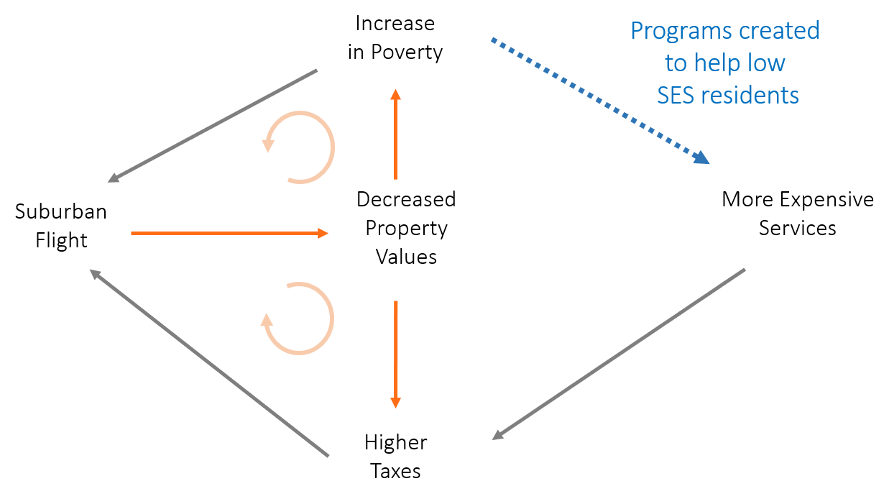

## The Great Debate - People vs Places

There is a long-standing debate in urban policy. Should we spend money helping people? Or should we spend money helping the places where disadvantaged people live? Neighborhood revitalization strategies target the latter. 

Ed Glaeser, a renouned urban economist, makes the argument for people provacatively in the articles, [Should the government rebuild New Orleans or just write residents checks](https://are.berkeley.edu/~ligon/Teaching/EEP100/glaeser05.pdf) and [Can Buffalo ever come back](https://www.city-journal.org/html/can-buffalo-ever-come-back-13050.html) 

*(his answers are write a check, and instead of subsidizing Buffalo residents to live in an unproductive geography we should use the money to help them move to Atlanta)*

He is exagerating a bit to highlight the peverse incentives inherent in a lot of economic development funding. He is a little more even-handed in the academic article titled, "[The Economics of Place-Making Policies](https://github.com/DS4PS/cpp-528-spr-2020/raw/master/articles/revitalization/the-economics-of-place-making-policies.pdf)":

-----

"Should the national government undertake policies aimed at strengthening the economies of particular localities or regions? ...**any government spatial policy is as likely to reduce as to increase welfare ...most large-scale place-oriented policies have had little discernable impact**.  Some targeted policies such as Empowerment Zones seem to have an effect **but are expensive relative to their achievements**. The greatest promise for a national place-based policy lies in impeding the tendency of highly productive areas to restrict their own growth through restrictions on land use."

-----

There are detractors that would argue Glaeser is wrong, many programs do work (for example see [Revitalizing Inner-City Neighborhoods: New York City's Ten-Year Plan](https://github.com/DS4PS/cpp-528-spr-2020/raw/master/articles/revitalization/Revitalizing_Inner_City_Neighborhoods.pdf) and [Building Successful Neighborhoods](https://github.com/DS4PS/cpp-528-spr-2020/raw/master/articles/revitalization/building-successful-neighborhoods.pdf) ). I suspect Glaeser’s response would be that exceptional success cases do not prove that the typical intervention produces intended (or large average) effects, and that even when they do work they are expensive relative to other alternatives. 

In their essay, [Who Benefits From Neighborhood Improvements?](https://www.strongtowns.org/journal/2017/11/1/who-benefits-from-neighborhood-improvements). Strong Towns makes an even stronger argument while cautioning about the unintended consequences of policy instruments created to promote development. After they exist they can be coopted by developers in order to capture some of the most valuable land in the city by taking it from poor residents: 

*The “shell [neighborhoods]” referred to above do not simply ‘appear’ as part of some naturally-occurring neighbourhood ‘decay’ – they are actively produced by clearing out existing residents via all manner of tactics and legal instruments, such as landlord harassment, massive rent increases, redlining, arson, the withdrawal of public services, and eminent domain/compulsory purchase orders. Closing the rent gap requires, crucially, separating people currently obtaining use values from the present land use providing those use values -- in order to capitalise the land to the perceived ‘highest and best’ use.*

So while Glaeser argues that place-based policies like neighborhood revitalization can be inefficient, Strong Towns argues that even worse they can be used against the residents that they were created to help. 

This is not the only example of intended effects of community improvement policies. In the book *Making Cities Work* Robert Inman highlights the trade-off between policies that strengthen the middle class in neighborhoods to keep them from becoming poor and keeping the community strong versus those that target the poor. Anti-poverty measures can enhance a white flight feedback loop that consequently can lead to higher concentrations of poverty in cities. 

*From the study by Haughwout and his colleagues (2004), summarized in table 11.3, we learn that in the four sample cities, higher taxes depress city property values and reduce jobs within the city, even allowing for the possibly positive effect of increased revenues on city services. The analysis is specified so that the effect of taxes on the tax base includes any offsetting effects added revenues might have from allowing more spending on valued city services.* 

*The estimated negative effect of taxes on property values suggests there is a "fiscal gap" between the costs of the taxes paid and the benefits received by those buying property in the city. It is significant. Haughwout and his colleagues (2004) estimate that Houston and New York City property owners receive no additional benefits from the last dollar of property taxes paid. Philadelphia and Minneapolis property owners receive, respectively, an estimated $.43 and $.77 in added benefits from their last dollar of city taxes.' If this last dollar is not providing sufficient benefits to taxpayers to justify its cost, where does the new tax money go?*

*Rather than to taxpayer services, it appears the incremental tax dollar goes to support required increases in poverty spending, public employee wages above improved worker productivity, and politically useful yet economically inefficient public projects.*

*The burden of city poverty on city taxpayers is twofold. First, a large poverty population implies a potentially large tax burden on middle-income households and firms. Table 11.4 shows the direct fiscal cost of cities' own poverty spending on median household incomes for a sample of large U.S. cities. Poverty spending per capita is significant, and the implied increase in the middle-class taxes needed to fund such expenditures can be as large as 2 to 3 percent of a city's median family income. This added tax burden is likely to drive middle-class families and firms from the city. Second, city poverty implies a possible increase in the costs of providing public services to city residents. K-12 education (Dunscombe and Yinger 1997) and resident safety (Glaeser and Sacerdote 1999) are the services whose costs are most likely to be increased by large poverty populations. Either city spending must rise or service quality must decline. Again, resident taxpayers and city firms will be tempted to leave the city. Their exit will undermine the city's consumption and production agglomeration advantages.*

*As the city's private sector economic performance declines, city and perhaps suburban property values fall. Outside grants to pay the costs of federal and state service mandates for lower-income families as well as aid for the added costs of service provision because of large concentrations of lower-income families are the appropriate policy responses. Removing the responsibility for city poverty from the city's budget is an important first step toward greater city fiscal efficiency.*

In this example the important thing to note is aid tied to families is bound by neighborhoods within cities. In effect, a poor household can only receive services if they move into central cities, whereas the same services are not offered in suburbs or wealthier neighborhoods. So it is a critique of economic apartheid more so than pro-poor policies. And even though services are provided to families they are still place-based policies and not people-based policies because they require the family to relocate to a poor neighborhood to access the services (e.g. public housing). A true people-based program would provide a voucher for the services in whichever community the household desired to live so they could follow opportunities instead of crowding into segregated and stressed census tracts (see [new findings from Moving to Opportunity](https://www.brookings.edu/blog/social-mobility-memos/2015/05/06/sociologys-revenge-moving-to-opportunity-mto-revisited/) project). 

## Program Dollars as the Treatment

The federal programs under consideration are one of many programs that consist of "aid" or "assistance" dollars being sent to vulnerable communities to catalyze some sort of change. 

One of my favorite data viz fails is this tone-def visualization of World Bank contracts presented by adapting what appears to be a World War III missile attack simulation. Development aid is launched from the donor country and explodes as it hits the recipient country:

[http://d3.artzub.com/wbca/](http://d3.artzub.com/wbca/)

The metaphor is apropros to this discussion because the science of economic development is still in the leaches phase of science and many argue that some policies do more harm than good. 

> It is important to identify clear goals or outcomes for these programs in order to build a theory of change around the intended impact and start to operationalize measures for outcomes. 

## Prediction vs Causality

If you are not feeling well the doctor might take a blood sample to test for cancer. They are looking for elevated levels of white blood counts and various protein markers. If present the doctor can detect cancer early and have a better chance of treating it effectively. 

Blood markers predict cancer. They do not cause it. Doctors almost never actually know the cause of a specific case of cancer, but they know from drug trials which medicines work for treating it.

Similarly, it is much easier to predict which census tracts are likely to improve over time than it is to explain the underlying causes. In policy we care about causality because we want to know if we implement a specific expensive revitalization policy it will create the intended changes. But prediction is also useful for planning and responsible governance of the process of change. 

As we move past descriptive analysis and into inferential models try to keep the two ideas distinct in your mind. Some of the census variables will help us predict which neighborhoods are likely to change over the next decade. But many of these are like blood markers - they provide information that can be used for prediction but don't necessarily explain the mechanisms. 

Our interest in tax credits, however, is causal. Saying that a model offers an unbiased estimate of program impact is the same thing as saying we have cleanly identified a causal mechanism. If you filter out white blood cells from a persons body you do not remove the cancer because the mechanism is not causal. If you increase dollars spent on revitalization in a neighborhood will you actually see more development occur? 

Take caution when interpretting variables that might be markers so that you do not make the mistake of saying things like immigrants drive down home prices and school performance. The actual mechanism is more likely immigrants are located in declining neighborhoods because it's where the cheapest housing is, but without immigrants the neighborhood would decline even faster. Correlation is not causation. Check your assumptions. 

More importantly, try to think about the requirements necessary to make the claim that economic development programs cause neighborhood change. There is a big selection problem here - tax credit programs are implemented by bankers and developers. This is prudent design because they have a vested interest in the tax credits working since investments in communities where they don't will create a loss for them. It limits wasteful spending on neighborhoods where the programs have no chance of success. On the other hand the program dollars are more likely to flow to neighborhoods that are most likely to experience growth since those are communities where return on investment is highest. As a result many resources are spent in communities where development would have occurred without the program. In this case the programs are not creating community change, and since they are likely flowing to communities that are expected to improve anyhow they are only effective if they create **more** change than we would have experienced without them. The counterfactual is really important in this context!

If a community is on the up-swing it will attract tax credit dollars, but it will also attract a lot of other types of investment. We can only cleanly identify the impact of tax credits if we can control for all other types of investment. Therein lies the rub. 

## Lack of Data

These above issues are raised not to argue that place-based initiatives are not effective or pro-poor policies are not helpful. Rather, it is to highlight the challenges of place-based economic development policy:

* We measure success of programs by the value locked in a neighborhood - mainly houses, household income, and schools. 
* Census data does not tell us whether rises in value are a result of infill development which diversifies a neighborhood economically and benefits current residents, or by displacing poor people and replacing them with wealthier residents. 

The challenge is that we do not have the appropriate data to really study this question. In the paper, “Designing Policies to Spur Economic Growth: How Regional Scientists Can Contribute to Future Policy Development and Evaluation” the authors make the argument that to improve policy-making we need to improve data because we currently cannot effectively measure the “treatment” in economic development - all of the investments and subsidies that occur within a tract (think of the missile launch visualization with aid coming from federal sources, state sources, and metro sources and flowing to specific census tracts), and using home value and income as outcome variables in these studies make it hard to tell which mechanism - growth or displacement - is driving the result. 

In a couple of weeks you will begin to look at data on the effectiveness of tax credit programs on catalyzing economic development. These programs were selected partly because they are some of the only large-scale federal programs that have made their data available and easy to access. 

The lack of data on this topic is a huge gap in the open data landscape. Only recently have serious attempts been made to measure the extent of these credits, and mostly by people outside of government, the most notable example being the [Panel Database on Incentives and Taxes](https://www.upjohn.org/research-highlights/new-database-and-report-reveal-how-much-states-spend-incentives-entice-businesses). But without good data on all government and private investments flowing into census tracts we are likely to produce biased evaluations of policy effectiveness. 

 

**Reflection** 

If you could get data on any capital expenditure or economic transfer that landed in a census tract, what data would you want to include in the model? 

Are there place-based investments like infrastructure or schools that you think would have a large impact?  

Private investments like new businesses (Starbucks and Whole Foods) or improvements to current housing stock. Parks? Bike paths? Recreation facilities? 

Alternatively are there any programs that target residents that live in the community that are not place-based that might have a significant impact? 

Assuming data is no issue, what sorts of investments or programs would you want to include in your model? Which variables would best predict neighborhood change? 

 

## Hedonic Pricing Methodology

Hedonic pricing models are statistical models where the outcome is home value.

Home price aggregates a tremendous amount of information about characteristics of houses, neighborhoods, and cities. We can use regression to separate out these difference attributes at different levels, and see they each contributes to the market value of a home. 

Since the median home value variable represents an entire census tract, these models focus on how neighborhood attributes and changes in amenities over time impact the average home price in the tract. 

[Hedonic Pricing Models Overview](https://github.com/DS4PS/cpp-528-spr-2020/raw/master/articles/home-value-change/hedonic-pricing-method.pdf)

[Hedonic Pricing Regression Example in R](https://github.com/buruzaemon/hedonic)

[Valuation Using Hedonic Pricing Models](https://scholarship.sha.cornell.edu/cgi/viewcontent.cgi?article=1058&context=crer)

